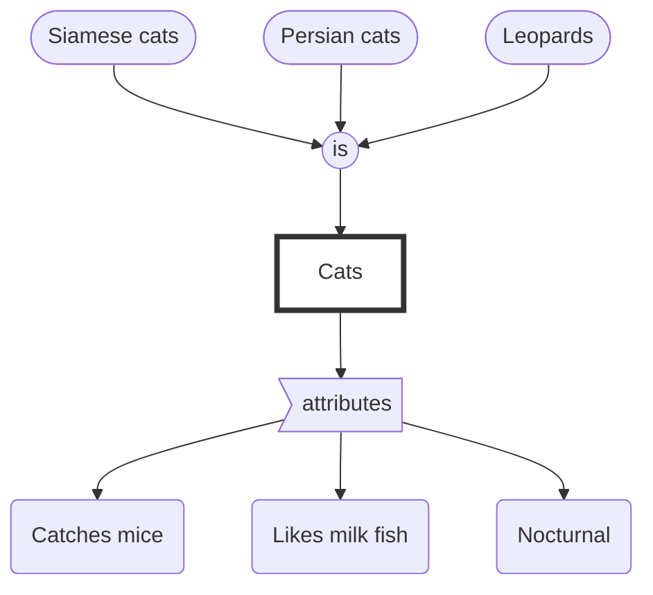

Written by: Laurits Lyngbæk
Source of information:  Cpt 9, p 262- 284	 [[Cognitive Psychology (2nd edition) Goldstein, B., & van Hoof, J.C. (2021).pdf]] 
Association links: [[002 IntoCog]]
Tags: #🌲Evergreen 
___
## Categorizing knowledge
Knowledge that enables you to recognize and understand objects around you is called **conceptual knowledge**
**Concepts** = "what animals is a cat"

Knowledge that enables you to recognize the meaning/traits of objects, events and ideas is called **semantic knowledge**.
**Semantics** =  What are the properties and behaviors of a cat?
### The concept of a cat

### Definitional approach to categorization
The normal approach to determining the characteristics of an object is to look up its definition.
According to definitional approach to categorization we can determine if something is a member of an category by determine if it fits the categories description. 

**Fork definition**:
an implement with two or more prongs used for lifting food to the mouth or holding it when cutting. 
--> By this definition a trident is also a fork.
### Prototype approach: Finding the average case
According to the* prototype approach to categorization*, membership in a category is determined by comparing the object to a prototype that represents the category. **A prototype** is a "typical" member of the category.

We then give objects an normative rating of how much an object fits the category, with 1 being the theoretical prototype, and 7 being the lea st "birdlike" bird. The more prototypical an object is (closer to 1) the faster we are to recognize it as part of an category.

| Effect             | Description                                                                                       | Experimental result                                                                                                                                                 |
| ------------------ | ------------------------------------------------------------------------------------------------- | ------------------------------------------------------------------------------------------------------------------------------------------------------------------- |
| Family resemblance | Things in a category resemble each other in a number of ways.                                     | Higher family resemblance or more attributes in common for high-prototypical items (Rosch, 1975a)                                                                   |
| Typicality         | People react rapidly to members of a category that are "typical" of the category                  | Faster reaction time to statements like "A X is a bird" for high-prototypical items like robin) than for low prototypical items (like ostrich) (Smith et al., 1974) |
| Naming             | People are more likely to list some objects than others when asked to name objects in a category. | High-prototypical items are named first when people list examples of a category (Mervis et al., 1976)                                                               |
| Priming            | Presentation of one stimulus affects responses to a stimulus that follows.                        | Faster same-different judgments for high prototypical items (Rosch, 1975b)                                                                                                                                                                |

### The exemplar approach: Thinking about examples
The *exemplar approach to categorization*, like the prototype approach, involves determining whether an object is similar to other objects.
Exemplars are actual members of the category that a person has encountered in the past.
As opposed to the prototype approach's normative rating, the fastest objects to categorize is the ones with the biggest number of resembling exemplars.

==**Prototype vs Exemplar**==
When we learn about a new category we use both the prototype and exemplar approach. However when we get more used to the category, we mainly use exemplar, so its easier to categorize outliers like "ostriches" and "penguins" in the bird category.
Some research indicates that exemplar works best for smaller categories, whilst prototype work better for larger categories. 