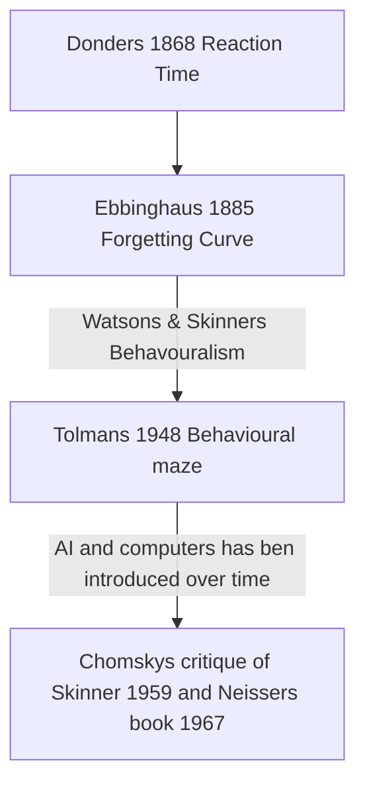

# Exam question
#📝Oral_exam
Please give a summary of chapter 1 (Introduction to Cognitive Psychology) in Goldstein & van Hoof, including illustrative experimental examples.

Title:
Cognitive Science: Studying the mind
___ 
Pages: [[Cognitive Psychology (2nd edition) Goldstein, B., & van Hoof, J.C. (2021).pdf]] 
p: 1 - 11

---

The chapter is a general history lesson of the history of cognitive psychology: 

The books definition of the mind: (its a lot of things, but helps us see the world)

**Introducing the timeline of the field**:

**Donders made the first "cognitive" experiment, proving that we had a reaction-time.** Small but started cognitive science (we had to make a decision/process something).

Qualitative vs Quantitative

**Ebbinghaus** introduced the Forgetting curve, showing we could prove complex intuitions about the cognition with science (forgetting) 
--> making seemingly qualitative measures quantitative.

Watson and **especially Skinner** introduced **behaviouralism** in hope of getting **structure in the cognitive psychology field**.

**Tolman** put this to the test with his Behavioural maze, showing that everything is conditioned. 

Different from Pavlov's dogs, as the rat was conditioned to understand where the reward was, not to only turn right. 

![[Pasted image 20211202104019.png]]

## The brain as a computer
A shift from Skinner's behaviouralism to thinking of the **brain as a computer**:
(Chomsky's critique of Skinner)
(The introduction of the computer)
(Interdisciplinary approaches made it possible)

Working memory experiment: Filtering attention experiment two earphones listening to two soundtracks.

 
 Brain as computer analogy introduced:
 - **brain "structure models"** -- tells the structure but not the how
- **mental "process models"** --> the simplified how, giving broad understanding.
- early "working memory"
 
 --> **Process model** (flow diagrams):
Logical internal statements decide the output
 ![[Memory_Overview]]
 
 
 ### Refer to other class / topic, but not so much that it doesn't seem like you understand the chapter.
 And the need for interdisciplinarity
 
 
 Example questions:
Can we try to tie these things together - example of how we use old 
fx how is behaviouralism used today 