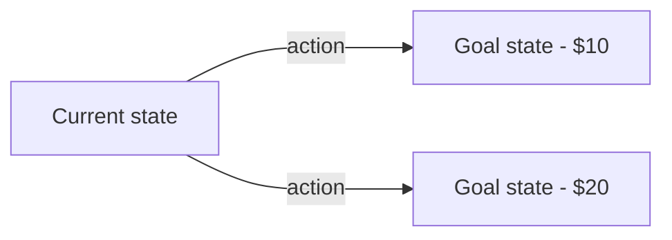
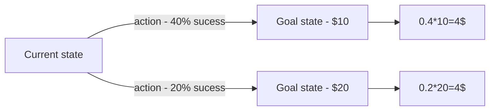

Written by: Laurits Lyngbæk
Source of information: [[Cognitive Psychology (2nd edition) Goldstein, B., & van Hoof, J.C. (2021).pdf|Cognitive Psychology - chapter 3 p 395-435]]
Association links: [[002 IntoCog]]
Tags: #🌲Evergreen 
___
# Judgment, Reasoning and Decision making
Is very popular because of its probability & utility!
## Basic principles
**Two questions for science**:
1) How should we use information to make decisions? (**Prescriptive models of Judgment**)

2) How do we make decisions? (**Descriptive and explanatory models of Choice**)
### Prescriptive models of judgment
#### Uncertain decisions 
Basic idea of decision making, you have to decide on a action to get you to your goal state:

   
Decision making => Action => increase **probability** of goal
Understanding uncertain decisions = Understanding probabilistic reasoning

Decisions under uncertainty (not sure what action achieves the goal with highest probability):

| Goals           | Actions              |
| --------------- | -------------------- |
| Be a professor  | Do PhD?              |
| Increase wealth | Invest?              |
| Prolong life    | Receive a treatment? |

#### Uncertain decisions with two goal states (Expected value theory)

In this example of two goal states, you should obviously choose the 20 dollars option: 


In this example your personality is gonna affect what is the right choise:



#### Bayes Theorem
**Probability** = chance that something is true = P(x) = y
**Conditional probability** = if a condition changes the probability, you have a new probability of making the right decision


A probability of a hypothesis, H, conditional 

**Bayes Theorem:**
where ${\displaystyle A}$ and ${\displaystyle B}$ are events and ${\displaystyle P(B)\neq 0}$

$$P(A|B)=\frac{P(B|A)P(A)}{P(B)}$$

![[Bayes Rule color.png]]

Bayes rule is a theory of how we **should** act, and not **how** we act.
Its therefore a **prescriptive model** for **reasoning about probabilities**.


### Descriptive and explanatory theories
#### Two common errors of probability reasoning 
##### Base rate neglect
We tend to neglect the base rate, and prefer decision from description.
![[Base rate neglect.png]]

##### Availability heuristic
When subjectively estimated probabilities are based on common cases or examples.
![[Availability heuristics.png]]


**YOUR CHOICE WILL DEPEND ON**:
   ```ad-note
title: EV = pX

- EV – Expected Value
- p – probability of the outcome
- X – value of the outcome
```

#### Expected Utility Theory vs Subjective Utility Theory
We make irrational decision based on these 3 factors: 

##### 1) The frame
How we you perceive the risk. 
e,g;   
**Win Frame:** 
I know we lost money. But don’t pull your investment out of my company! We ‘re 70% sure we’ll make you 1000kr next year!

**Loss Frame:** (we want to make money back, more than make new money)
I know we lost money. But don’t pull your investment out of my company! We ‘re 70% sure we’ll get you 1000kr **back** next year!


Prospect theory is how you feel about loosing / winning:
![[Prospect theory.png]]
We feel more strongly about loosing, so you want to put focus on **not loosing** in the framing, to convince people.

##### 2) Your endowment
#🥀Missing 

##### 3) Your preference for risk
   Risk preference is determined by the shape of the utility function
```ad-info
title: Risk preferences and the coin toss
If we use the exmpel of the coin toss:
!!! ad-faq
    title: Experiment
    500kr for sure, or a 50% chance to receive 1000kr

We can map preferance for risk:
– Risk neutral: don’t care
– Risk averse: 500kr
– Risk seeking: coin tos

How to dertmine a persons preferance for risk in complicated cases:

	A person is risk averse if, when asked to choose between a certain outcome on the one hand, and a lottery with the same expected value as the certain outcome, they choose the certain outcome
```
Subjective (personal) value assessment vs Objective value
![[Utility vs Value.png]]

Risk preference in coin experiment:
![[Utility and value as risk.png]]


  


