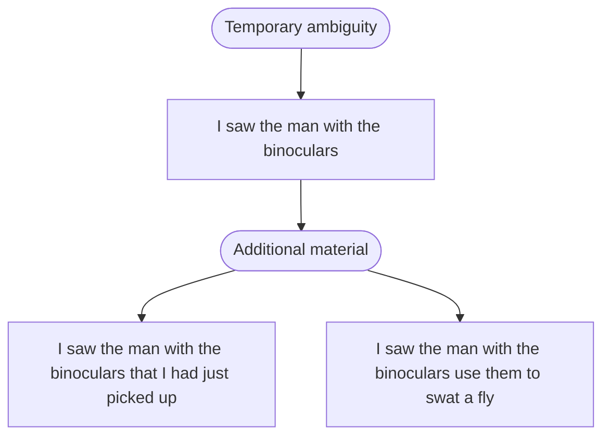

Written by: Laurits Lyngbæk
Source of information:[[Talking_the_talk.pdf|Talking the Talk - Chapter 5 + 7]]
Association links: [[001 CogCom]] [[Semantic Network]]
Tags: #🌲Evergreen 
___
# Meaning
## What is meaning
When we try to communicate a *meaningful* sentence, we aren't sure the recipient of our language understands the sentence in the way we *meant*. 
If we try to talk about a *dog*, it can be all kind of breeds, a dog with a missing leg and so forth. We could in theory also talk about a [[Psychologically privileged level of categories|higher level of category fx mamal]], and still be correct.

But in reality as discussed in [[Knowledge]] it seems that [[Semantic Network|Semantic Networks are a better way of describing "meaning"]], as categories become more interlinked. This theory become even more nuanced, *and maybe to broad*, with the introduction of the [[Connectionist approach]]. 

[[Semantic paralexia]]
When a person (with deep dyslexia) makes a semantic paralexia, they pronounce a word as though it’s related in meaning to the one they’re trying to read. A few examples should make this clear.

Daughter is read as “sister”. 
Kill is read as “hate”. 
Rose is read as “flower”. 
Sergeant is read as “soldier”.

### [[Grounding]]
Our internal representations are grounded in our perceptions, actions, and feelings. [[The representation of concepts in the brain#The embodied approach|This is very similar to the embodied approach]]. Concepts have very direct links to the world, concepts and meaning aren’t just abstract, amodal things: thinking about real-world objects for example involves the visual perceptual system.

## *Understanding* meaning
The process of bringing two mental representations together so they share more than they did before the linguistic interchange is called alignment.

Human sentence processing mechanism (HSPM)
![[Human sentence processing mechanism (HSPM).png]]

Temporary ambiguity (a sentence that can be understood in multiple ways) can by resolved by additional material:

### How do we deal with temporary ambiguity?
According to the ==**garden-path model**,== we pick the most likely structure on syntactic grounds, and carry on with it unless we’re forced to reanalyse by  new information. (uses two stages, the first using syntax, and a reconsideration using semantics)

According to the ==**constraint-based model**==, we use multiple sources of information to assign a structure The parser (listener) use multiple uses multiple sources of information, **called constraints**, to activate **alternative syntactic** structures in **parallel**.

#### Metaphor theory
We apply abstract things to simple metaphors, to understand the world in an "embodied" / "spatial" way.

[[Computational methods to analyse language]]
