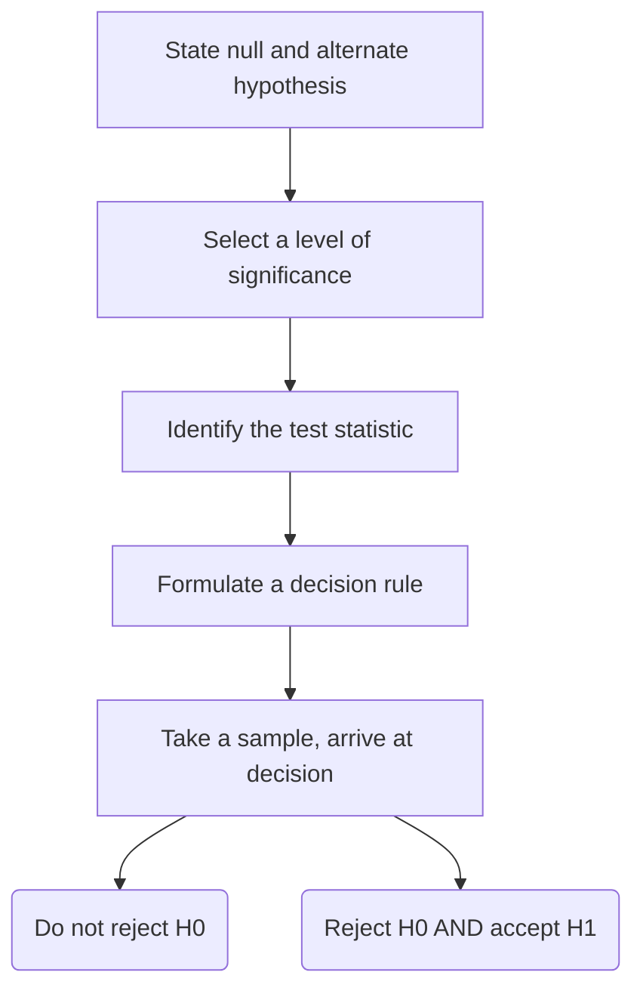

Written by: Laurits Lyngbæk
Source of information: Chapter 9-10 (p. 174-196) [[Statistics for Linguists.pdf]]
Slides: [[Lecture_6_Experimental_design_and_hypothesis_testing.pdf|Lecture 6]]
Association links: [[Statistics]]
Tags: #🌲Evergreen 
___
# Inferential statistics
Inferential statistics are tools that statisticians use to draw conclusions about the characteristics of a population.
 
$\sigma_\bar{x}$ is a measure of the uncertainty of a single sample value as an estimate of the population value.
$\sigma_\bar{x}$ becomes smaller when the sample size increases.

$\sigma_\bar{x}$ can roughly be estimated with the following:
$$\sigma_\bar{x}=\frac{s}{\sqrt{n}}$$

s = standard deviation
n = sample size

*requires*:
- Sample is roughly normally distributed
- n is large (at least ~20/30 measurements)

## Claims about population

```ad-example
title: The 3 ingredients for confidence about claims on the population
1) **The magnitude of a difference **
	All else being equal, the bigger the difference between two groups, the more you should expect there to be a difference in the population

2) **The variability in the data**
 All else being equal, the less variability there is within the sample, the more certain you can be that you have estimated a difference accurate
 
3) **The sample size **
	All else being equal, bigger samples allow you to measure differences more accurately

```

### The magnitude of a difference
The bigger difference of result *(effect size)* there is between two groups, fx male and female, the more confident you can be in your claim = $\bar{x_1}-\bar{x_2}$. 

#  Standardized measures of effect size
There are also standardized measures of effect size: $R^2$, Pearson's r and and standardized regression coefficients.
### Cohen’s d
Cohen’s d is another standardized measures of effect size. 

**The formula for Cohen’s d** is simply the difference between two means (the raw strength of an effect) divided by the standard deviation of both two groups together (the overall variability of the data):
$$|d|=\frac{\bar{x_1}-\bar{x_2}}{s}$$
The bigger the d the better, it doesn't matter if its positive or negative

##### R code
```r
pacman::p_load(effsize) 
cohen.d(x ~ y, data = "dataframe")
```

## T-test
$$t = \frac{\frac{\text{variance between groups}}{\text{variance within the group}}}{\sqrt{\text{sample size}}}$$
<=>
$$t = \frac{\frac{\text{mean difference}}{\text{standard deviation}}}{\sqrt{\text{degrees of freedom}}}$$
<=>
$$t = \frac{\frac{\bar{x_1}-\bar{x_2}}{s}}{\sqrt{N}}$$
The t-value can be converted to the p-value, to  get an value in % of likelihood of the chance to get this result again, using a table of conversion.

#### Assumptions of a t-test
1. Measurement is on a continuous or ordinal scale.
2. The data is collected from a representative, randomly selected portion of the total population. 
3. The data, when plotted, results in a normal distribution, bell-shaped distribution curve 
4. A reasonably large sample size is used 
5. The final assumption is homogeneity of variance. Homogeneous, or equal, variance exists when the standard deviations of samples are approximately equal.

### Three types of t-test
```ad-example 
title: The 3 types of t-tests
1) **Independent samples t-test**
	- For between-participant designs
	- assumes independent data points and equal variances between groups

2) **Paired samples t-test**
	- for within-participant designs
	- assumes dependent data points and unequal variances between groups

3) **One-sample t-test**
	- for comparing the mean of one sample to a specific value (μ)
```

#### Independent samples t-test
H0: The difference between the two means is 0
H1: The difference between the two means is ≠ 0


$$t = \frac{(\bar{x_1}-\bar{x_2})-(\mu_1-\mu_2)}{\sqrt{\frac{s_1^2}{N_1}+\frac{s_2^2}{N_1}}}$$
```r
# Independent samples t-test in r
	t.test(outcome ~ predictor,data = dataframe_name, var.equal = TRUE)
```

#### Paired samples t-test
H0: The difference between the two means is 0
H1: The difference between the two means is ≠ 0
$$t = \frac{\bar{D}-\mu_D}{\sqrt{\frac{s_1^2}{N_1}+\frac{s_2^2}{N_1}}}$$
$\bar{D}$ = the mean of the difference of the responses between the two conditions for each participant
$\mu_D$ = The difference in population means we’d expect if H0 were true
```r
# Independent samples t-test in r
t.test(outcome ~ predictor, data = dataframe_name, paired = TRUE)
```


#### One-sample t-test
H0: The sample mean is equal to the population mean
H1: The sample mean is different from the population mean
$$t = \frac{\frac{\bar{x}-\mu}{s}}{\sqrt{N}}$$

$\bar{x}$ =the sample mean
$\mu$ = the population mean
$\frac{{s}}{\sqrt{N}}$ = the SE of the mean

```r
# One-samples t-test in r

	t.test(dataframe_name$outcome, mu = H0 mean)
```

## Null hypothesis significance testing (NHST)
Null Hypothesis Significance Testing (NHST) is a common statistical test to see if your research findings are statistically interesting. Start by stating a null hypothesis ($H_0$ ) and a corresponding alternative hypothesis ($H_A$).

When performing a significance test on the difference between two groups, this null hypothesis is usually:
$H_0$ : there is no difference between groups

The alternative hypothesis ($H_A$) is usually what the researcher actually believes in. In this case, the alternative hypothesis may be:
$H_A$ : there is a difference between groups

**In mathematical notation, this translates to**:
$H_0 : \mu_1 = \mu_2$
$H_A : \mu_1 \neq \mu_2$

### Common misinterpretation of p-values
````ad-info
title: Misinterpretations
How to nest a file using python markdown
``` ad-warning
    title: P-value represents the probability of the null hypothesis being true
    One common misinterpretation is that the p-value represents the probability of the null hypothesis being true. This is not the case. Always remember that the null hypothesis is an assumption—its truth cannot be known.
```
``` ad-warning
	title: P-value represents the strength of an effect
	The statistics used in significance testing, such as t, do in fact incorporate effect size, but they also take the sample size into account. Measures such as t and the resulting p compress **The magnitude of a difference **, **The variability in the data** and **The sample size** into a single number
	Thus, it is possible that a ‘significant’ result is very ‘insignificant’ in terms of effect size. This is why it’s important to always mention some measure of effect size alongside the results of significance tests
```
``` ad-warning
	title:if p < 0.05, then one is justified to believe more strongly in one’s hypothesis.
	This is not the case for **two reasons**. 
	1) The p-value *measures the incompatibility* of the data with the null hypothesis $H_0$ , it doesn’t allow any direct conclusions about the alternative hypothesis $H_A$. 
	2) p < 0.05 says nothing concretely about the data at hand, instead, acting in line with this *threshold ensures that you make correct decisions 95% of the time* in the long run.
```

````


### Errors in NHST
````ad-info
title: Type I, II, M and S Errors
``` ad-fail
	title:Type I Error
	False significant results are called Type I errors.
	A Type I error involves obtaining a significant effect even though the null hypothesis is actually a true characteristic of the population.
	A Type I Error is represented by the letter $\alpha$
```
``` ad-fail
	title: Type II Error
	A Type II error involves failing to obtain a significant effect even though the null hypothesis is false. 
	The Type II error rate is represented by the letter $\beta$
```
In particular, **low-powered studies** are more likely to suffer from what are called **Type M and Type S errors**
``` ad-fail
	title: Type M Error
	A Type M error is an error in estimating *the magnitude of an effect*, such as when your sample indicates a much **bigger effect** than is **actually characteristic** of the population.
```
``` ad-fail
	title: Type S Error
	A Type S error is even worse; it represents a **failure to capture the correct sign of an effect**. 
	For example, your sample may indicate taste words to be more positive than smell words, but in fact it’s **the other way around in the population**.
```
````

**Clarification** of type I and II Error:

| Results from your sample -->                 | p < 0.05                        | p > 0.05                              |
| -------------------------------------------- | ------------------------------- | ------------------------------------- |
| Nothing is there ($H_0$ is actually true)    | Type I Error                    | Correct decision (don’t claim result) | 
| Something is there ($H_0$ is actually false) | Correct decision (claim result) | Type II Error                         |


#### Family-wise error rate (FWER)
The ‘family-wise error rate’ is the probability of obtaining at least one Type I error for a given number of tests.
Since all significance tests have a positive Type I error rate, the more tests a researcher conducts, the more likely they are going to stumble across a Type I error.
In the following formula, k represents the number of tests conducted at the specified alpha level (in this case α = 0.05):
$$FWER = 1 - (1-0.05)^k$$

You can make significance tests more conservative depending on how many tests a researcher conducts, by correcting the $\alpha$ level.
- The Bonferroni method asks you to reset your alpha level depending on k, the number of tests. The alpha rate is simply divided by the number of tests: $\text{corrected }\alpha= \frac{\alpha}{k}$

$\alpha = \text{the p-value needed to reject }H_0$

```ad-example 
title: The 3 takeaways of statistical errors
1) Aim for high-powered studies. 

2) Don’t conduct lots of theoretically unmotivated hypothesis tests without correcting your alpha level (your life will be easier if you limit the number of tests based on theoretical reasoning). 

3) Don’t make data collection contingent on having obtained a significant result—decide in advance how many participants you want to run.


```

### Five-step Procedure for testing a Hypothesis


### Same vs different populations:
Do the differences in our samples reflect differences that also exist in the population (→ true effect) or
Or from the same underlying population? (→ sampling noise?)
from p17 of [[Lecture_6_Experimental_design_and_hypothesis_testing.pdf]]
![[Same vs different populations.png]]
