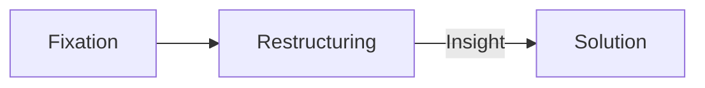

Written by: Laurits Lyngbæk
Source of information: [[Cognitive Psychology (2nd edition) Goldstein, B., & van Hoof, J.C. (2021).pdf|Cognitive Psychology - Chapter 12]] 
Association links: [[002 IntoCog]] [[Memory]]
Tags: #🌲Evergreen 
___
#  Problem solving
## What is a problem
A **problem** occurs when there is an ***obstacle*** between a **present state** and a ***goal***

**Problem space**: Set of states the problem can be in
1. Start state
2. Intermediate states
3. Goal state

### Well- and ill-defined problems
Problems can be well- or ill-defined problems, we try to turn ill-defined problems into well-defined problems.

**Well-defined problems**
Have specific goals, clearly defined solution paths, and clear expected solutions.

**Ill-defined problems**
Does not have clear goals, solution paths, or expected solution.
(Very human problems like a good life, success etc.)

### What is problem solving
**Characteristics of cognitive problem solving**
> - Goal directedness
> - Setting of subgoals
> - Operator application

## How we solve problems
**Descriptive approaches**
Investigate how cognitive systems solve problems

**Prescriptive approaches**
Investigate how cognitive systems can optimize problem solving

*Cognitive sciences research dwell in the midst of these two approaches.*
### Gestalt approach

| Name          | Function                                                                                                           |
| ------------- | ------------------------------------------------------------------------------------------------------------------ |
| Fixation      | People's tendency to focus on a specific characteristic of the problem that keeps them from arriving at a solution |
| Restructuring | The process of changing the problem's representation                                                               |
| Insight       | The sudden realization of a problem's solution (the thing that gets you saying "aha!")                             |

### Information processing approach:
**EXAMPLE OF IP-APPROACH PROBLEM SOLVING**:
**Problem:**
![[Tower of Hanoi problem.png]]

| Term               | Description                                                                                                  | Exampel from Tower of Hanoi                                                                   |
| ------------------ | ------------------------------------------------------------------------------------------------------------ | --------------------------------------------------------------------------------------------- |
| *Initial state*      | Conditions at the beginning of a problem                                                                     | All three discs are on the left peg                                                           |
|  *Goal State*         | Solution to the problem                                                                                      | All three discs are on the right peg                                                          |
| *Intermediate state* | Conditions after each step is made toward solving a problem                                                  | After the smallest disc is moved to the middle peg, the two larger discs are on the left peg. |
| *Operators*          | Actions that take the problem from one state to another, Operators are usually governed by rules             | Rule: A larger disc can't be placed on a smaller one                                          |
| *Problem space*      | All possible states that could occur when solving a problem                                                  | See ![[Problemspace for tower of Hanoi.png]]                                                   |
| *Means-end analysis* | A way of solving a problem in which the goal is to reduce the difference between the initial and goal states | Establish subgoals, each of which moves the solution closer to the goal state                 |
| *Subgoals*           | Small goals that create intermediate states that are closer to the goal.                                     | One movement that moves us closer to the solution                                             | 

 ### Finding Operators: ANALOGY (encoding)

Process by which a problem solver maps the solution for one problem onto a solution for another problem
**OBS**: Analogy involves noticing that a past problem solution is relevant,  and then mapping the elements from that solution to produce an **operator** for the current problem.

#### Expert vs novice problem solving
The studies of expert vs novice doesn't involve experts at problem solving vs novices at problem solving. But rather EX vs NOV in a field. Only in the experts field of expertise, their skills increase their odds. 