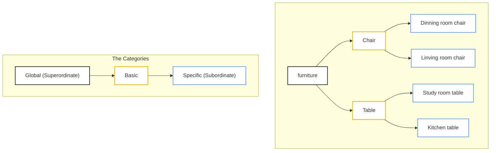

Written by: Laurits Lyngbæk
Source of information: [[Cognitive Psychology (2nd edition) Goldstein, B., & van Hoof, J.C. (2021).pdf|Cognitive Psychology (2nd edition)]]
Association links: [[Knowledge]]
Tags: #📑ChildNode 
___
## Psychologically privileged level of categories
### Hierarchical organization of levels of categories 
**Rosch, Mervis, Gray, Johnson and Boyes-Braem (1976)'s:  ==3 levels of categories==**

Cognitive psychologists have asked whether there is a basic type of category that is more important/"privileged" than other.  The basic category is more "privileged" than others because its the one we use to describe specific objects on the go (global categories is to broad)

The more knowledge we have of an object, the more specific the categorization will be.
