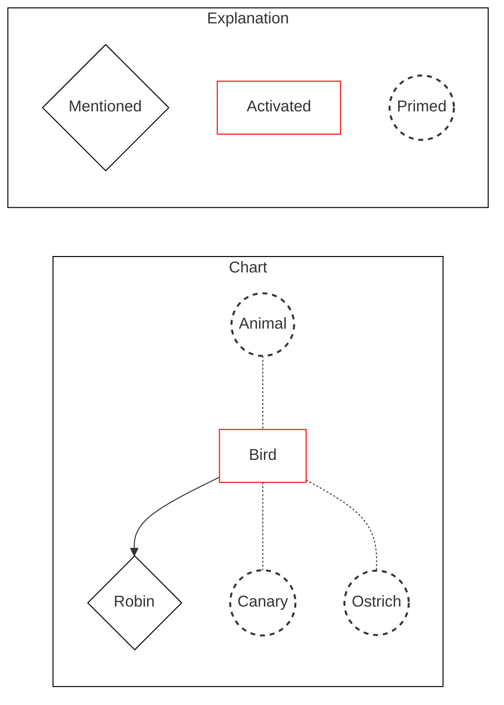

Written by: Laurits Lyngbæk
Source of information: [[Cognitive Psychology (2nd edition) Goldstein, B., & van Hoof, J.C. (2021).pdf|Cognitive Psychology (2nd edition)]]
Association links: [[Knowledge]]
Tags: #📑ChildNode 
___
## Representing relationships between categories: Semantic networks
### The semantic network approach
Semantic networks is a visualization of the memories hierarchical categories and associations, with more specific categories at the bottom. 
![[Semantic Network 2.png]]
![[Semantic Network.png]]
##### How semantic networks are created
Semantic networks are produced by asking participants to answer "yes or no" to questions.
It should take participants longer to answer "is a rose a living thing" than "is a rose a flower", this allows us to determine the hierarchy of the categories in the network. This also means that the longer you have to travel in the semantic network, the longer it takes to answer the question. For example, "A canary can sing" is faster than "A canary has skin", as you have to travel 2 categories for "A canary has skin".

Questioned as "an ostrich is a bird" has a longer RT than "an canary is a bird", even though they both only are one node from bird.

#### Cognitive economy
The semantic network approach describes how we save memory capacity by [[Short-term memory (STM)#^chunking|chunking]] traits to different levels of categories .
This way of storing shared properties just once at a higher-level node Is called [cognitive economy].
For an ostrich, that can't fly, we would have to explicitly store the trait "can't fly" at ostrich level, as the bird category contains "can fly".

Cognitive economy has been questioned as a "a shark can move" (high frequent attribute) has the same RT as "A trout has a mouth" (low frequent attribute).
#### Spreading activation
Spreading activation is activity that spreads out along any link that is connected to an activated node. 
For example, "Robin" gets mentioned, and spreading activation activates bird, and primes connecting nodes:
