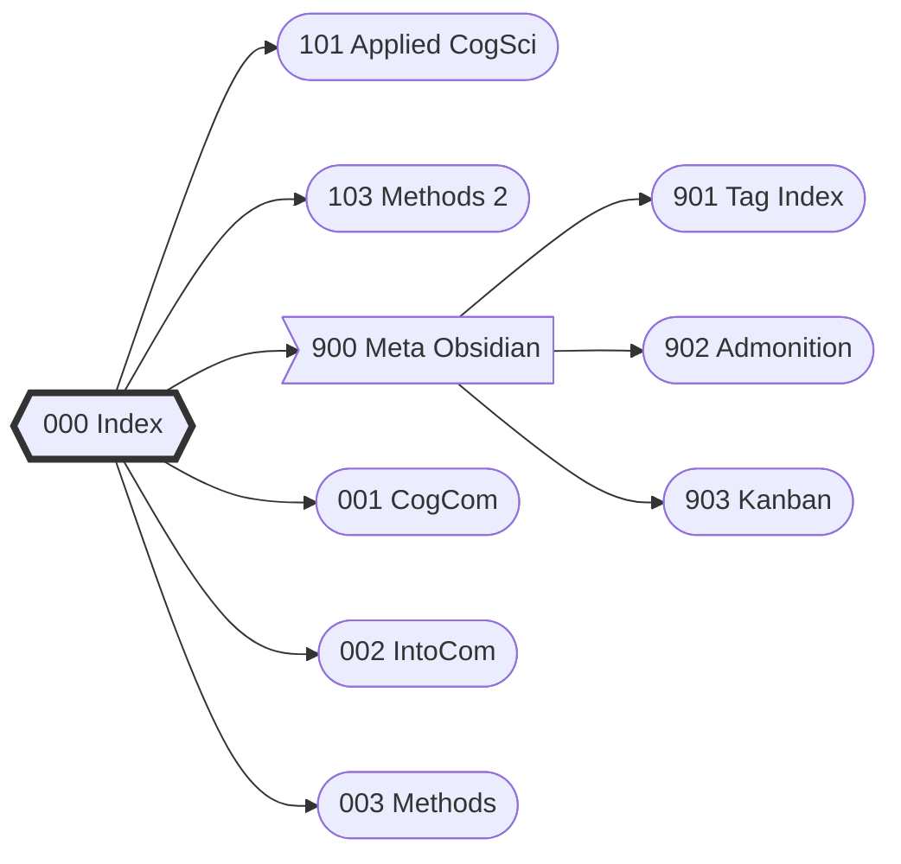

# Index
> Index for cognitive science
# Navigation flow chart
**Click flow diagram to navigate**

![[901 Tag Index#Meta tags]]

___
### Tag connections
[[001 CogCom]]
[[002 IntoCog]]
[[003 Methods]]
[[900 Meta Obsidian]]
[[101 Applied Cognitive Science]]
[[102  Philosophy of Cognitive Science]]
[[103 Methods 2]]
[[201 Perception and Action]]
[[203 Methods 3]]

___
#🗂️Organization 

