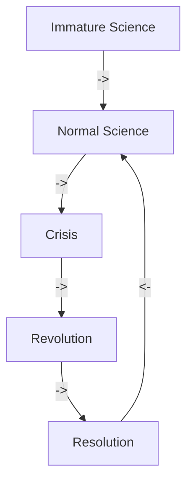

From doubt to belief through scientific method -> **falsificationism** need **empirical data**: lets move away form empirical causes to measurable data.

Cognitive science (behaviourism, computationalism, connectionism and embodiment) was a reaction to the previous psychology research.

Psychoanalysis, Gestalt and Pragmatism: studies of internal structure of personality, perception and goals.

**Behaviourism:**
Pavlov's dogs -> classical conditioning -> Skinner -> Operant conditioning

**1) External operation = independent variable** 
2) Internal state = intervening variable 
**3) Behaviour = dependant variable**

Tolman (Tolman rat in maze develops cognitive maps)
Stroop and the Stroop-effect indicates that mental processes (resources) are limited to an internal state and not behaviour. 

#### PARADIGM CRISIS
Poppers falsification, and the quine duhem thesis
To explain how we can do science after the **Quine-Duhem Thesis**, paradigms allow as a **descriptive network**, that allows for evolvement of **auxiliary assumptions**, and thus allows for creating **in situ science**.

**Computationalism**
**Computation is**: implementation-independent, formal symbol manipulation, that is systematically interpretable
Cognitive revolution -> Turing machine might be a good model -> internal states as an explainer

**John Searle vs Computationalism**: Symbol grounding problem
Chinese room,
Learn chinese only with a chinese to chinese dictionary
Script theory

Computational cognition passes a T2 test, but still lacks  **intrinsic semantics**.

To get **semantics** you must pass at least a **T3 Turing test**. But then your system won’t be **implementation independent.**
Tries to mimic the neuronal structure by creating artificial networks as models.

*Casual grounding*: when **seeing a dog the system says do**g, might argue the **dog is an external referent**

**Internal grounding**: 
representation have sufficient internal structure --> intrinsic content
semantics may rise from syntax
**Problem:**
The semantics arise from the internal structure (hidden units), but the attractors are still set by programmers
Therefore **it is not intrinsic/naturally developed semantics**.

To reach intrinsic symbol grounding, a t4 test must be passed, introducing another crisis and the embodiment paradigm:

**Embodiment**:
Regulation The use of feedback by another system (or part) to impose constraints on a system
(child walking when held up) - ![[Pasted image 20220616085346.png]]

Cognition should not be explained computationally, but by using the anatomy and physiology of the body and brain 
The body
(a) constrains,
(b) distributes, 
(c) regulates cognition
Brain, body, and environment function as a mutually constraining dynamical system supporting cognition

What is it like to be a bat? -

"It is not analyzable in terms of any explanatory system of functional states, or intentional states, since these could be ascribed to robots or automata that behaved like people though they **experienced nothing**." Nagel 1974

Paradigms may shift repeatedly as long we try to impose human cognition as the standard of consciousness to other machines.

