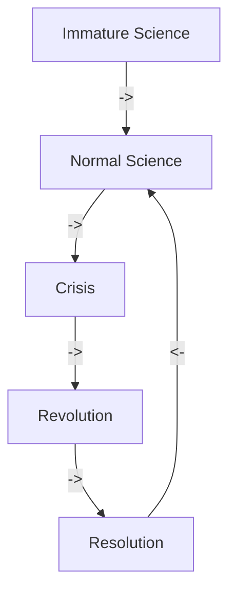

Written by: Laurits Lyngbæk
Source of information: [[The_structure_of_Scientific_Revolutions_Thomas_Kuhn.pdf]]
Association links: [[102  Philosophy of Cognitive Science]]
Tags: #🌱Seed 
___
We can rate scientific methodology's merits according to four criteria:
1. Whether use of the methodology produces valuable results
2. Whether the methodology is generally easy to employ
3. Whether the methodology (somewhat) matches current scientific results
4. Whether it is possible to employ the methodology
 

# Scientific paradigms
The idea of scientific paradigms was introduced by Thomas Kuhn.

He argued that knowledge wasn't linear, but that scientific paradigms changed every now and then, and with this new change what could be studied changed as well.

This means that every few years the paradigm of what can/will be studied will be reset, and our knowledge in the new paradigm will start anew. 

## What is paradigms and paradigm shifts: 
### Thomas Kuhn - The father of paradigms
Thomas Kuhn describes his ideas of paradigms as a descriptive network. It is therefore not a challenger to fx Falsifications.

1) There is no such thing as neutral observation
2) All observation is embedded in theory

*That is:*
A theory $T_1$, cannot be verified or falsified without considering the grander network of theories {$T_1,T_2, ...,T_n$} that $T_1$ is part of

**Paradigms**

Science is impossible outside of a paradigm, as outside of a paradigm, there are no goals, research methods, standards of truth, rationality, and observations, theories of explanation and interpretation etc. 
Thus, all normal science is paradigm bound.

#### Paradigms in cognitive science
* Behaviourism
* Computationalism
* Connectionism
* Embodiment

**Keywords:**
Puzzle solving
Repeating falsification = Crisis = Revolutionary science.
To explain how we can do science after the **Quine-Duhem Thesis**, paradigms allow as a descriptive network, that allows for evolvement of auxiliary assumptions, and thus allows for creating in situ science.