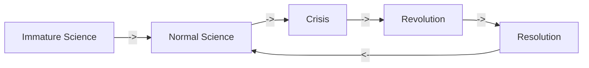

#📝Oral_exam 
[[102  Philosophy of Cognitive Science]]
## First mock exam
Q: Argue how cognitive science qualifies as a science through the lenses of Kuhn.
___
To answer the question of: ---, the structure of my arguments will be:
Through the lenses of Kuhn a metaphysical golden standard doesn't exist for science i.e. a science praxis that is perfect.
He instead introduces paradigms, that i will explain.
CogSci is a good example of a paradigms *shift* that attracted a group of practitioners to this field.

### Definition of paradigms:
**_Normal science_** "means research firmly based upon one or more past scientific achievements, achievements that some particular scientific community acknowledges for a time as supplying the foundation for its further practice" (p10).

i.e.
Science should be based on old sciences achivements, and follow the ideas of how to praxis that science.

1.  These _achievements_ must be
	1. sufficiently **_unprecedented_** to attract a group away from competing modes of scientific activity and
	2. sufficiently **_open-ended_** to leave all sorts of problems for research.
2. These achievements can be called _paradigms_ (10).

This paradigm will be followed until another paradigm overtakes this place.
**Paradigms**

### Paradigms switching to cognitive science.
Psychology -> Behaviourist -> Cognitive Psychology
Better at explaining addiction, mental illness and others.

Cognitive science had switches of paradigmes that was introduced by technology:
Computer getting introduced computationalism, and better AI networks led to connectionism.

This doesn't mean that cogsci has the final paradigme, no science has that according to Kuhn, but it beats other paradigmes at the moment, and is therefore the current proper science praxis. 

___
# Feedback
**What is a science**: Poppers falsifiability
**How is it a science**: CogSci uses falsifiability, and by it empirical experimental praxis this allows falsifiability. You can not find truth but find the best approximation of truth.
**Is the lenses mentioned:** 
Karl Popper mentioned, problem of demarcation, empirical sciences from metaphysical systems. Contained with the criteria's of empirical sciences. Logical positivism had deduction: popper criticized this deduction could be false at anytime (ex of the white swan). 