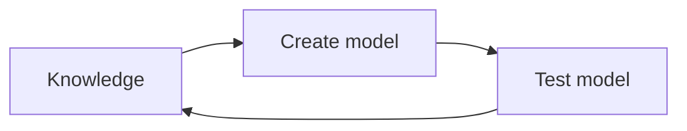

Written by: Laurits Lyngbæk
Source of information: 
Association links: [[103 Methods 2]]
Tags: #🌲Evergreen 
___
For introduction to regressions
[[Logistic Regression]]

___
# Regression
Is a tool for deciding an outcome based on a set of data. Regression will always be based on a linear predictor.
Regressions is for fitting models based on associations between predictors and outcomes. 
Summary of an association between data. 


## Regression modelling
### [[Linear Regression#Linear regression|General Linear Model]]
**Mean					vs 							Linear regression**
![[Mean vs Linear regression.png]]
The **general linear model** (**GLM**) is the most basic regression model:
```ad-tip
title: 
$$Y_i=\beta_0+\beta_1 X_1+\epsilon_i$$
```
When constructing a model you need


**The regression line** = The line that minimizes the sum of the squares of the error (residuals)
or
**The regression line** = The line that minimizes the vertical distances between the model and the data points

You can use matrix models:
[[Matrix linear model]]

### Linear models that aren't linear
```ad-tip
title: When is something linear in mathematics
**Everyday linearity:** 
A straight line
**Mathematical linearity:** 
$y=f(x)$ **if** $f(ax_1+bx_2)=af(x_1)+bf(x_2)$
```
The model is linear if the $\beta$ coefficients are added on e.g. $f(\beta)=\beta_1x+\beta_2x^2$. The predictor "x's" doesn't matter for linearity. 

This means that we can make linear regression without the regression line being linear.

### Statistical troubles in regression
```ad-example
The three challenges of statistics
!!! ad-warning
    title: Generalizing from sample to population
    A problem that is associated with survey sampling but actually arises in nearly every application of statistical inference.
!!! ad-warning
    title: Generalizing from treatment to control group
    a problem that is associated with causal inference, which is implicitly or explicitly part of the interpretation of most regressions we have seen.
!!! ad-warning
    title: Generalizing from observed measurements to the underlying constructs of interest
    as most of the time our data do not record exactly what we would ideally like to study.


```
### Lol

![[PICTURE 1.1 METHODS 2.png]]